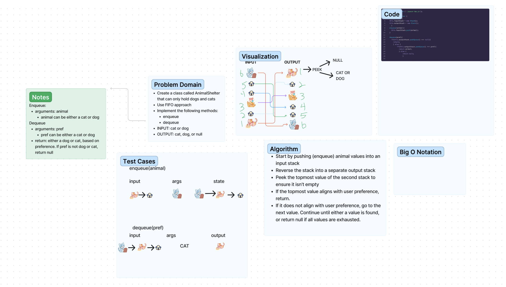
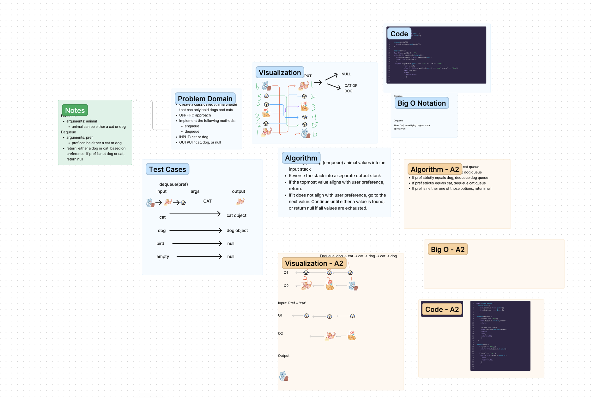

# Code Challenge 12: Animal Shelter

- Create a class called AnimalShelter which holds only dogs and cats.
  - The shelter operates using a first-in, first-out approach.
- Implement the following methods:
  - enqueue
    - Arguments: animal
    - animal can be either a dog or a cat object.
  - dequeue
    - Arguments: pref
    - pref can be either "dog" or "cat"
    - Return: either a dog or a cat, based on preference.
    - If pref is not "dog" or "cat" then return null.

## Approach

I don't know why, but my brain immediately went to our pseudoqueue challenge. Initially, I thought it would be cool to push animals, nondiscerning, into a stack, reverse that stack, and use conditional statements to pop off animal values. There were several reasons why this approach didn't work.

Which leads me to the second approach I ended up taking. I knew the two queue idea was a solution some folks were working through. During code review, I realized I was overthinking the problem. Creating two queues makes sense in terms of organizing animals and dequeing based off of breed. The following whiteboard reflects the second approach.

