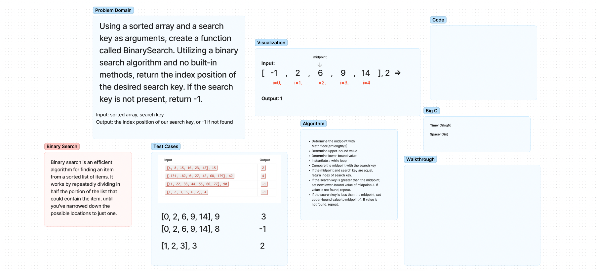

# Binary Search of Sorted Array

- This challenge involved designing a binary search algorithm that would return the index of a desired search key given a sorted array and aforementioned search key as arguments. The assignment required no built-in methods be used.

## Whiteboard Process

## Approach & Efficiency

- I took a pointer method of sorts, determining the midpoint, upper-bound, and lower-bound values of the array. After instantiating a loop, the algorithm would solve for a midpoint value, and if the value did not match the search key, would adjust the upper and lower bound values dependent upon conditional statements that would dictate whether or not the search key was greater than or less than the midpoint. The algorithm would progress further and further into the array until the search key is found.

- This approach has a time complexity of O(logN) and space complexity of O(n) due to the iterative nature of the code.
