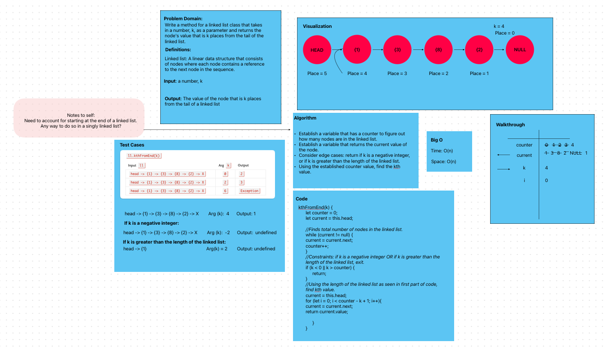
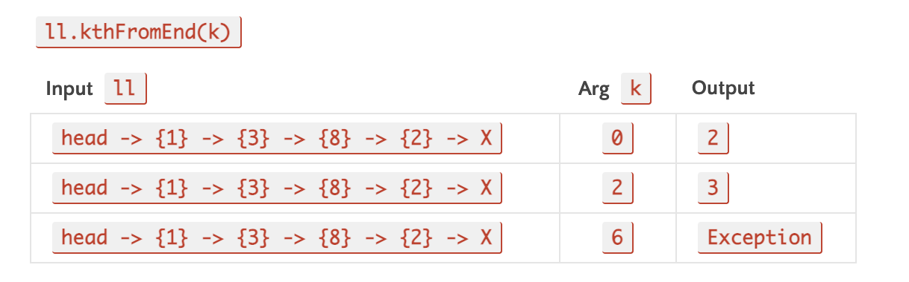

# Challenge type: Extending an implementation

Problem domain: Write a method for a linked list class:

- kth from end

- arguments: a number, k, as a parameter

- returns: the node's value that is k places from the tail of the linked list.

- Note: You have access to the NOde class and all the properties on the Linked List class as well as the methods created in previous challenges.

## Whiteboard Process

Test Cases

Other tests to consider:

  - Where k is greater than the length of the linked list

  - Where k and the length of the list are the same

  - Where k is not a positive integer

  - Where the linked list is of a size 1

  - “Happy Path” where k is not at the end, but somewhere in the middle of the linked list

### Approach and Efficiency
